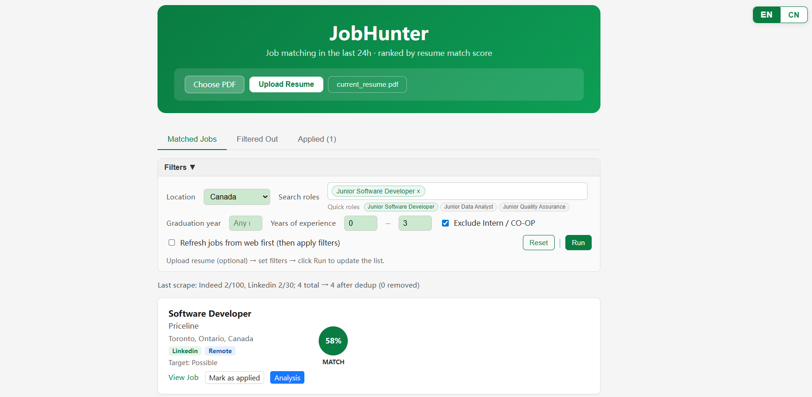

# JobHunter

**AI-powered job matching — scrape, score, filter, and analyze jobs ranked by your resume fit.**

JobHunter pulls job postings from Indeed and LinkedIn, scores each one against your resume using a 4-component hybrid model, filters out irrelevant or too-senior roles, and presents everything in a clean React web UI. Optional DeepSeek ATS analysis gives you a detailed breakdown of how well you match each position.

---



---

## Features

- **Multi-source scraping** — Indeed (up to 100 results) and LinkedIn (up to 30) via `jobspy`, with per-site error handling so one site failing won't crash the run
- **4-component hybrid scoring**

  | Component | Weight | Notes |
  |-----------|--------|-------|
  | Semantic similarity | 40% | `sentence-transformers` (all-MiniLM-L6-v2) |
  | Keyword matching | 35% | `rapidfuzz` fuzzy match against resume skills |
  | Title bonus | 15% | Junior / Entry-Level / New Grad / Graduate / Early-Career |
  | Location bonus | 10% | Toronto/Mississauga +10 pts, Ontario +5 pts |

- **Smart filtering** — auto-excludes PhD-required roles, 4+ years experience, Level II+/III+, senior leads (Test Lead, QA Lead…), intern/co-op postings, and non-software titles (Construction, Mechanical Engineer, Hydrologist, etc.)
- **Resume-aware keyword extraction** — `pdfplumber` parses your PDF; 160+ tech keywords across languages, frameworks, cloud, DevOps, AI/ML, and tools
- **ATS deep analysis** — DeepSeek API produces a structured match report per job (strengths, gaps, suggestions); results are cached in `data/ats_analysis_cache.json` so you never re-call the API for the same job
- **React web UI** — job cards with match score circle, source badge (indeed/linkedin), remote badge, salary range, and a per-job ATS Analysis drawer
- **Resume upload** — upload a new PDF through the UI; `hunt.py` automatically uses the uploaded resume over the fallback

---

## Project Structure

```
JobHunter/
├── hunt.py                     # Entry point: scrape → score → filter → write xlsx
│
├── src/                        # Core logic
│   ├── config.py               # Paths, resume selection, skill loading
│   ├── resume.py               # PDF extraction, keyword matching
│   ├── scoring.py              # 4-component hybrid score
│   ├── filters.py              # Seniority / role-type filtering rules
│   ├── salary.py               # Salary extraction from JD text
│   ├── scrape.py               # jobspy wrapper (per-site, robust)
│   └── ats.py                  # DeepSeek ATS analysis
│
├── api/
│   └── app.py                  # Flask API + ATS cache
│
├── ui/
│   └── src/
│       ├── App.jsx             # Main page
│       ├── JobList.jsx         # Job list + pagination
│       ├── JobCard.jsx         # Job card with score circle + badges
│       └── ResumeUpload.jsx    # Resume upload & preview
│
├── config/
│   ├── tech_keywords.yaml      # 160+ tech keywords for resume parsing
│   └── job_positions.yaml      # Per-position skill & weight presets
│
├── data/
│   ├── uploads/                # Uploaded resume (current_resume.pdf)
│   ├── job_hunt_results.xlsx   # Output: Jobs + Filtered_Out sheets
│   └── ats_analysis_cache.json # Cached ATS results (auto-generated)
│
├── .env                        # Local secrets (not committed)
└── requirements.txt
```

---

## Quick Start

### 1. Install dependencies

```bash
# Python backend
pip install -r requirements.txt

# React frontend
cd ui && npm install
```

Requires **Python 3.10+** and **Node 18+**.

### 2. Set up DeepSeek (optional, for ATS analysis)

Create a `.env` file in the project root:

```
DEEPSEEK_API_KEY=your_key_here
```

The app runs fine without this — ATS analysis buttons in the UI will be unavailable until a key is set.

### 3. Start the backend *(Terminal 1)*

```bash
python api/app.py
```

Runs on `http://localhost:5000`. Keep this terminal running.

### 4. Start the frontend *(Terminal 2)*

```bash
cd ui
npm run dev
```

Open **http://localhost:5173** in your browser. Keep this terminal running.

### 5. Scrape and score jobs *(Terminal 3)*

```bash
# Simplest — uses all defaults (Junior Software Engineer, Canada)
python hunt.py

# Or specify your own search
python hunt.py --search "Software Engineer" --location "Canada"
```

Results are written to `data/job_hunt_results.xlsx`. Refresh the UI to see them.

---

## Usage

### `hunt.py` options

```bash
# Use all defaults (recommended for first run)
python hunt.py

# Custom search
python hunt.py --search "Junior Software Engineer" --location "Canada"

# Common flags
--results 30          # Results per site (default: 30)
--analyze-top 10      # Run ATS analysis on top N jobs after scraping (default: 0)
--resume-pdf path     # Override resume path

# Use a preset skill profile from config/job_positions.yaml
--config config/job_positions.yaml --position backend    # Java, Python, SQL, Spring, Docker
--config config/job_positions.yaml --position frontend   # JavaScript, React, TypeScript, CSS
--config config/job_positions.yaml --position data       # Python, SQL, ML, Pandas, Statistics
```

### API endpoints

| Endpoint | Method | Description |
|----------|--------|-------------|
| `/api/jobs` | GET | All jobs (Jobs + Filtered_Out), sorted by score |
| `/api/jobs/analyze` | POST | ATS analysis for a single job (cached) |
| `/api/resume` | POST | Upload a PDF resume |
| `/api/resume/status` | GET | Check if a resume has been uploaded |
| `/api/resume/file` | GET | Stream the current resume PDF |

---

## Tech Stack

| Layer | Tech |
|-------|------|
| Scraping | `python-jobspy`, `pandas` |
| NLP / scoring | `sentence-transformers`, `rapidfuzz` |
| Resume parsing | `pdfplumber` |
| ATS analysis | DeepSeek API |
| Backend | Flask, Flask-CORS |
| Frontend | React 18, Vite 5, Ant Design |

---

## Resume Auto-Selection

`hunt.py` picks the resume in this priority order:

1. `RESUME_PDF` environment variable (if set)
2. `data/uploads/current_resume.pdf` (uploaded via the UI)
3. `Grace_cs3.pdf` in the project root (fallback)

---

## Filtering Logic

Jobs are classified as **Too Senior** and moved to the `Filtered_Out` sheet when any of the following match:

- Title contains intern / co-op / student keywords
- Title is a non-software role (construction, environmental, medical, accounting, trades, etc.)
- Title contains Level 2+ or Roman numerals II/III/IV+
- Description requires 4+ years of experience, or uses Senior / Staff / Principal / Lead
- Job targets 2026 graduates (when the user graduated in 2025)

Entry-level titles (Junior, Associate, Entry-Level, New Grad) are protected from senior-pattern false positives in the description.
