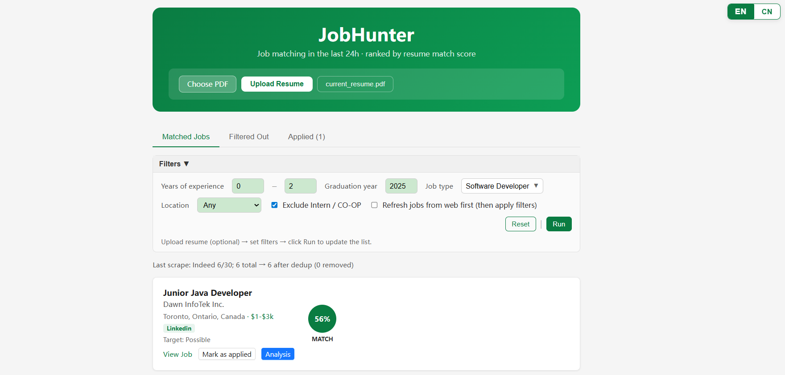

# JobHunter

**AI 驱动的职位匹配工具 — 自动抓取、打分、过滤，按简历契合度排名。**

JobHunter 从 Indeed 和 LinkedIn 抓取职位，用四路混合评分模型对每个职位与你的简历做匹配，自动过滤不合适或太高级的岗位，并在简洁的 React 网页界面中展示结果。可选接入 DeepSeek API 对高分职位做 ATS 深度分析。

---



---

## 功能亮点

- **多源抓取** — Indeed（最多 100 条）和 LinkedIn（最多 30 条），逐站点调用，单站失败不影响其他站点结果
- **四路混合评分**

  | 评分组件 | 权重 | 说明 |
  |----------|------|------|
  | 语义相似度 | 40% | `sentence-transformers`（all-MiniLM-L6-v2） |
  | 关键词匹配 | 35% | `rapidfuzz` 模糊匹配简历技能关键词 |
  | 标题加分 | 15% | Junior / Entry-Level / New Grad / Graduate / Early-Career |
  | 位置加分 | 10% | Toronto/Mississauga +10 分，Ontario +5 分 |

- **智能过滤** — 自动排除需要博士学历、要求 4 年以上经验、Level II+/III+、高级 Lead 岗（Test Lead、QA Lead 等）、实习/Co-op 岗，以及非软件岗位（建筑、机械工程、环境科学、会计等）
- **简历关键词提取** — `pdfplumber` 解析 PDF；覆盖 160+ 技术关键词，包括编程语言、前后端框架、云平台/DevOps、AI/ML、开发工具
- **ATS 深度分析** — DeepSeek API 逐职位输出结构化匹配报告（优势、差距、建议）；结果缓存至 `data/ats_analysis_cache.json`，同一职位不会重复调用 API
- **React 网页界面** — 职位卡片含 Match Score 圆环、来源徽章（indeed/linkedin）、Remote 徽章、薪资区间，以及单职位 ATS Analysis 抽屉
- **简历上传** — 通过网页上传新 PDF，`hunt.py` 自动优先使用上传的简历

---

## 项目结构

```
JobHunter/
├── hunt.py                     # 入口：抓取 → 打分 → 过滤 → 写 xlsx
│
├── src/                        # 核心逻辑
│   ├── config.py               # 路径、简历选择、技能加载
│   ├── resume.py               # PDF 提取、关键词匹配
│   ├── scoring.py              # 四路混合评分
│   ├── filters.py              # 岗位级别 / 类型过滤规则
│   ├── salary.py               # 从 JD 文本提取薪资
│   ├── scrape.py               # jobspy 封装（逐站点、容错）
│   └── ats.py                  # DeepSeek ATS 分析逻辑
│
├── api/
│   └── app.py                  # Flask API + ATS 结果缓存
│
├── ui/
│   └── src/
│       ├── App.jsx             # 主页面
│       ├── JobList.jsx         # 职位列表 + 分页
│       ├── JobCard.jsx         # 职位卡片（分数圆环 + 徽章）
│       └── ResumeUpload.jsx    # 简历上传与预览
│
├── config/
│   ├── tech_keywords.yaml      # 160+ 技术关键词库（简历解析用）
│   └── job_positions.yaml      # 职位技能与权重预设（可选）
│
├── data/
│   ├── uploads/                # 上传的简历（current_resume.pdf）
│   ├── job_hunt_results.xlsx   # 输出：Jobs + Filtered_Out 两个 Sheet
│   └── ats_analysis_cache.json # ATS 分析缓存（自动生成）
│
├── .env                        # 本地密钥（不提交到 git）
└── requirements.txt
```

---

## 快速开始

### 1. 安装依赖

```bash
# Python 后端
pip install -r requirements.txt

# React 前端
cd ui && npm install
```

需要 **Python 3.10+** 和 **Node 18+**。

### 2. 配置 DeepSeek（可选，用于 ATS 分析）

在项目根目录新建 `.env` 文件：

```
DEEPSEEK_API_KEY=你的密钥
```

不配置也可以正常运行，只是网页上的 ATS Analysis 按钮不可用。

### 3. 启动后端 *（终端 1）*

```bash
python api/app.py
```

默认运行在 `http://localhost:5000`，保持该终端运行。

### 4. 启动前端 *（终端 2）*

```bash
cd ui
npm run dev
```

浏览器打开 **http://localhost:5173**，保持该终端运行。

### 5. 抓取并打分 *（终端 3）*

```bash
# 最简单的方式 — 使用所有默认参数（Junior Software Engineer，Canada，每站点 30 条）
python hunt.py

# 或者自定义搜索
python hunt.py --search "Software Engineer" --location "Canada"
```

结果写入 `data/job_hunt_results.xlsx`，刷新网页即可查看。

---

## 使用说明

### `hunt.py` 常用参数

```bash
# 使用所有默认参数（推荐第一次运行时使用）
python hunt.py

# 自定义搜索
python hunt.py --search "Junior Software Engineer" --location "Canada"

# 常用参数
--results 30              # 每个站点抓取数量（默认 30）
--analyze-top 10          # 抓取后对前 N 名做 ATS 分析（默认 0，不分析）
--resume-pdf 路径          # 手动指定简历路径

# 使用 config/job_positions.yaml 中的预设技能配置
--config config/job_positions.yaml --position backend    # Java, Python, SQL, Spring, Docker
--config config/job_positions.yaml --position frontend   # JavaScript, React, TypeScript, CSS
--config config/job_positions.yaml --position data       # Python, SQL, ML, Pandas, Statistics
```

### API 端点

| 端点 | 方法 | 说明 |
|------|------|------|
| `/api/jobs` | GET | 返回所有职位（Jobs + Filtered_Out），按分数降序 |
| `/api/jobs/analyze` | POST | 单职位 ATS 分析（结果自动缓存） |
| `/api/resume` | POST | 上传 PDF 简历 |
| `/api/resume/status` | GET | 查询是否已有上传的简历 |
| `/api/resume/file` | GET | 返回当前简历 PDF（浏览器内预览） |

---

## 技术栈

| 模块 | 技术 |
|------|------|
| 抓取 | `python-jobspy`、`pandas` |
| NLP / 打分 | `sentence-transformers`、`rapidfuzz` |
| 简历解析 | `pdfplumber` |
| ATS 分析 | DeepSeek API |
| 后端 | Flask、Flask-CORS |
| 前端 | React 18、Vite 5、Ant Design |

---

## 简历自动选择逻辑

`hunt.py` 按以下优先级选择简历：

1. 环境变量 `RESUME_PDF`（如果设置了）
2. `data/uploads/current_resume.pdf`（通过网页上传的）
3. 项目根目录下的 `Grace_cs3.pdf`（默认兜底）

---

## 过滤规则说明

满足以下任一条件的职位会被标记为 **Too Senior**，移入 `Filtered_Out` Sheet：

- 标题含实习 / Co-op / Student 关键词
- 标题属于非软件岗（建筑、环保、医疗、会计、体力劳动等）
- 标题含 Level 2+ 或罗马数字 II/III/IV+
- 描述要求 4 年以上经验，或出现 Senior / Staff / Principal / Lead
- 职位面向 2026 届毕业生（用户为 2025 届）

标题本身含 Junior / Associate / Entry-Level / New Grad 的职位受到保护，不会因描述里出现 Senior/Lead 字样而被误杀。
